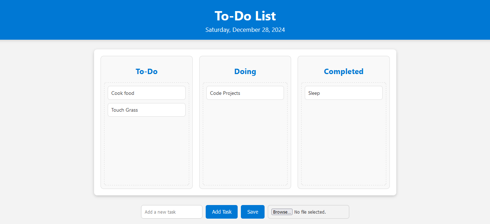

# To-Do Webpage

A simple, interactive to-do list webpage that allows users to add tasks, organize them into categories (`To-Do`, `Doing`, `Completed`), save the list to a `.txt` file, and upload previously saved tasks. This project demonstrates basic front-end web development concepts using HTML, CSS, and JavaScript.



## Features

- **Task Management**: Add, drag, and drop tasks between categories.
- **Save Tasks**: Save the list of tasks to a `.txt` file with a simple format.
- **Upload Tasks**: Upload old task lists from a `.txt` file to restore previous tasks.
- **Responsive Design**: Mobile-friendly layout and design.
- **Task Sorting**: Tasks can be moved between `To-Do`, `Doing`, and `Completed` sections.

## Technologies Used

- **HTML**: Markup for structuring the page.
- **CSS**: Styling for a clean and modern design.
- **JavaScript**: Dynamic task management, including saving and uploading tasks.
- **File Handling**: Using JavaScript to create and download `.txt` files and upload existing ones.

## Installation

Clone the repository:

```bash
git clone https://github.com/proobker/To-do_Webpage.git
```
Navigate to the project directory:

```bash
cd To-do_Webpage
```
Open the ``layout.html`` file in your browser to run the project:
```
open layout.html
```
Usage

    Add Task: Enter a task in the input box and click "Add Task" to add it to the To-Do list.
    Drag and Drop: Move tasks between To-Do, Doing, and Completed sections by dragging and dropping them.
    Save Tasks: Click "Save" to download the current task list in a .txt file format.
    Upload Tasks: Click "Choose File" to upload a .txt file and restore the saved task list.

File Format for Upload

The .txt file should follow this structure:

---
Date: [Date]
To-Do:
Task 1
Task 2

Doing:
Task 3

Completed:
Task 4

Screenshots

To-Do Webpage Screenshot
Contribution

Contributions are welcome! Follow these steps to contribute:

    Fork this repository.
    Create a new branch:

git checkout -b feature-name

Commit your changes:

git commit -m "Add feature description"

Push to the branch:

    git push origin feature-name

    Create a pull request.

License

This project is licensed under the MIT License.
Contact

For queries or feedback, contact:

    Email: rrabi.dahal@gmail.com
    GitHub: proobker

Thank you for exploring this repository! We hope this project helps you manage your tasks efficiently.
